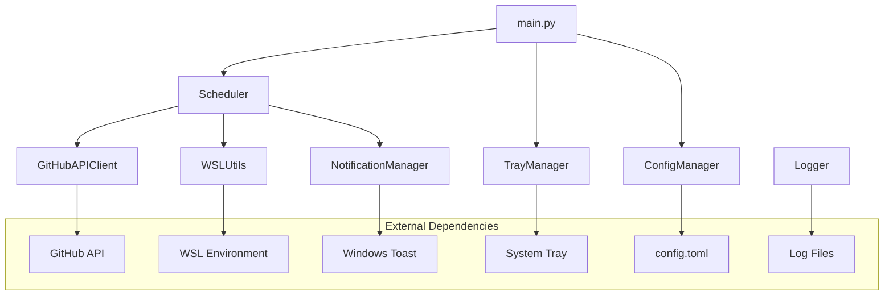

# 設計書

## 概要

WSLカーネル安定版リリース監視ツールは、GitHub APIを使用してWSL2カーネルの新しいリリースを監視し、Windowsトースト通知でユーザーに知らせる常駐型Pythonアプリケーションです。モジュラー設計により保守性と拡張性を確保し、堅牢なエラーハンドリングと設定管理を提供します。

## アーキテクチャ

### システム構成図



### レイヤー構成

1. **プレゼンテーション層**: タスクトレイUI、通知表示
2. **アプリケーション層**: メインロジック、スケジューリング
3. **ドメイン層**: バージョン比較、設定管理
4. **インフラストラクチャ層**: GitHub API、WSL連携、ファイルI/O

## コンポーネントと インターフェース

### 1. ConfigManager
**責務**: 設定ファイルの読み込み、検証、デフォルト値管理

```python
class ConfigManager:
    def load_config(self) -> Config
    def create_default_config(self) -> None
    def validate_config(self, config: Config) -> bool
```

**設定項目**:
- `check_interval_minutes`: チェック間隔（デフォルト: 30分）
- `repository_url`: 監視対象リポジトリ（デフォルト: microsoft/WSL2-Linux-Kernel）
- `enable_build_action`: ビルドアクション有効化（デフォルト: false）
- `notification_enabled`: 通知有効化（デフォルト: true）

### 2. GitHubAPIClient
**責務**: GitHub APIとの通信、レート制限対応、リトライ処理

```python
class GitHubAPIClient:
    def get_latest_stable_release(self, repo: str) -> Release
    def is_prerelease(self, release: Release) -> bool
    def handle_rate_limit(self) -> None
```

**実装詳細**:
- requests + urllib3.Retry使用
- 指数バックオフによるリトライ戦略
- レート制限ヘッダーの監視

### 3. WSLUtils
**責務**: WSL環境との連携、カーネルバージョン取得

```python
class WSLUtils:
    def get_current_kernel_version(self) -> str
    def compare_versions(self, current: str, latest: str) -> int
    def execute_build_script(self) -> bool
```

**実装詳細**:
- subprocess使用でWSLコマンド実行
- セマンティックバージョニング対応
- タイムアウト設定とエラーハンドリング

### 4. NotificationManager
**責務**: Windowsトースト通知の表示と管理

```python
class NotificationManager:
    def show_update_notification(self, current: str, latest: str) -> None
    def register_click_handler(self, callback: Callable) -> None
    def is_notification_supported(self) -> bool
```

**実装詳細**:
- Windows-Toastsライブラリ使用
- Windows 10/11対応
- 通知クリック時のコールバック処理

### 5. TrayManager
**責務**: システムトレイアイコンとメニュー管理

```python
class TrayManager:
    def create_tray_icon(self) -> None
    def update_icon_state(self, has_update: bool) -> None
    def show_context_menu(self) -> None
    def quit_application(self) -> None
```

**実装詳細**:
- pystrayライブラリ使用
- アイコン状態管理（通常/更新あり）
- コンテキストメニュー（設定、終了）

### 6. Scheduler
**責務**: 定期実行とタスク管理

```python
class Scheduler:
    def start_monitoring(self) -> None
    def stop_monitoring(self) -> None
    def check_for_updates(self) -> None
```

**実装詳細**:
- APSchedulerライブラリ使用
- 設定可能なチェック間隔
- 非同期実行対応

## データモデル

### Config
```python
@dataclass
class Config:
    check_interval_minutes: int = 30
    repository_url: str = "microsoft/WSL2-Linux-Kernel"
    enable_build_action: bool = False
    notification_enabled: bool = True
    log_level: str = "INFO"
```

### Release
```python
@dataclass
class Release:
    tag_name: str
    name: str
    published_at: datetime
    prerelease: bool
    html_url: str
```

### VersionInfo
```python
@dataclass
class VersionInfo:
    current_version: str
    latest_version: str
    update_available: bool
    last_checked: datetime
```

## エラーハンドリング

### エラー分類と対応

1. **GitHub API エラー**
   - ネットワークエラー: 指数バックオフでリトライ
   - レート制限: 制限解除まで待機
   - 認証エラー: ログ出力、デフォルト動作継続

2. **WSL エラー**
   - WSL未インストール: エラー通知、監視停止
   - コマンド実行エラー: ログ出力、次回チェック時に再試行

3. **設定ファイル エラー**
   - ファイル不存在: デフォルト設定で新規作成
   - 形式エラー: エラーログ、デフォルト値使用

4. **通知エラー**
   - 通知システム無効: ログ出力、トレイアイコンで代替表示

### ログ戦略

```python
# ログ設定例
logging.basicConfig(
    level=logging.INFO,
    format='%(asctime)s - %(name)s - %(levelname)s - %(message)s',
    handlers=[
        logging.FileHandler('wsl_kernel_watcher.log'),
        logging.StreamHandler()
    ]
)
```

## テスト戦略

### テスト分類

1. **単体テスト**
   - 各コンポーネントの個別機能テスト
   - モック使用で外部依存を排除
   - カバレッジ目標: 80%以上

2. **統合テスト**
   - コンポーネント間の連携テスト
   - GitHub API実際の呼び出しテスト
   - WSLコマンド実行テスト

3. **システムテスト**
   - エンドツーエンドの動作確認
   - 通知表示の手動確認
   - 長時間実行の安定性テスト

### テスト環境

- **開発環境**: pytest + pytest-mock
- **CI環境**: GitHub Actions
- **モック対象**: GitHub API、WSLコマンド、Windows通知

### テストデータ

```python
# テスト用のモックデータ例
MOCK_RELEASE_DATA = {
    "tag_name": "linux-msft-wsl-5.15.90.1",
    "name": "Linux-msft-wsl-5.15.90.1",
    "published_at": "2023-03-15T10:00:00Z",
    "prerelease": False,
    "html_url": "https://github.com/microsoft/WSL2-Linux-Kernel/releases/tag/linux-msft-wsl-5.15.90.1"
}
```

## セキュリティ考慮事項

1. **GitHub API認証**
   - Personal Access Tokenの安全な管理
   - 環境変数での認証情報管理

2. **WSLコマンド実行**
   - コマンドインジェクション対策
   - 実行権限の最小化

3. **設定ファイル**
   - 設定値の検証とサニタイズ
   - 不正な設定値の拒否

4. **ログ出力**
   - 機密情報のログ出力回避
   - ログファイルのアクセス権限設定

## パフォーマンス考慮事項

1. **メモリ使用量**
   - 常駐アプリケーションとして軽量化
   - 不要なオブジェクトの適切な解放

2. **ネットワーク効率**
   - GitHub APIの効率的な利用
   - キャッシュ機能の実装検討

3. **CPU使用率**
   - 定期チェックの最適化
   - バックグラウンド処理の効率化

## 拡張性設計

1. **プラグイン機構**
   - 通知方法の拡張可能性
   - 監視対象リポジトリの追加

2. **設定の柔軟性**
   - 新しい設定項目の追加容易性
   - 設定UIの将来的な実装

3. **多言語対応**
   - メッセージの国際化対応
   - 設定ファイルでの言語選択